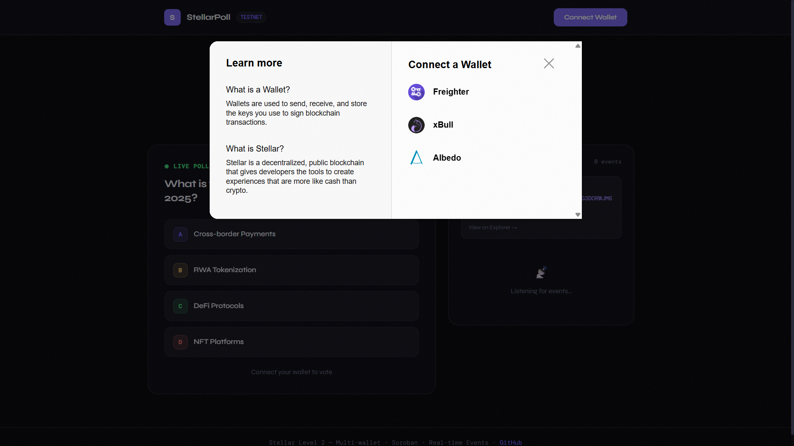
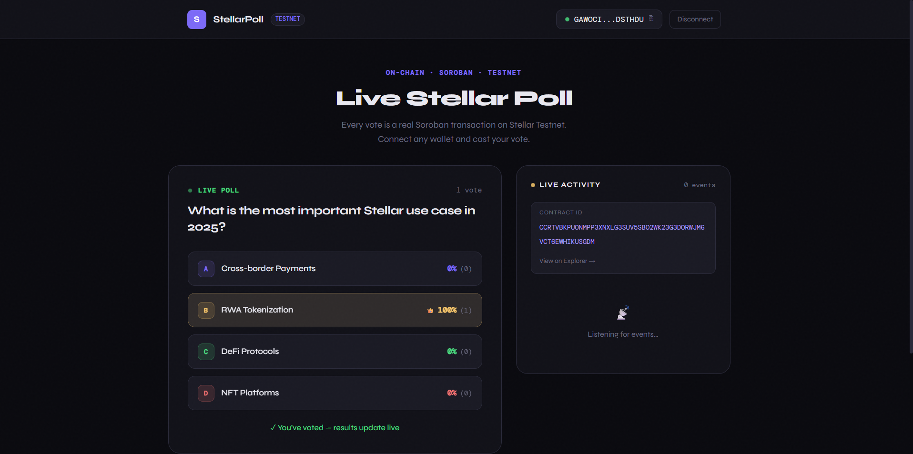
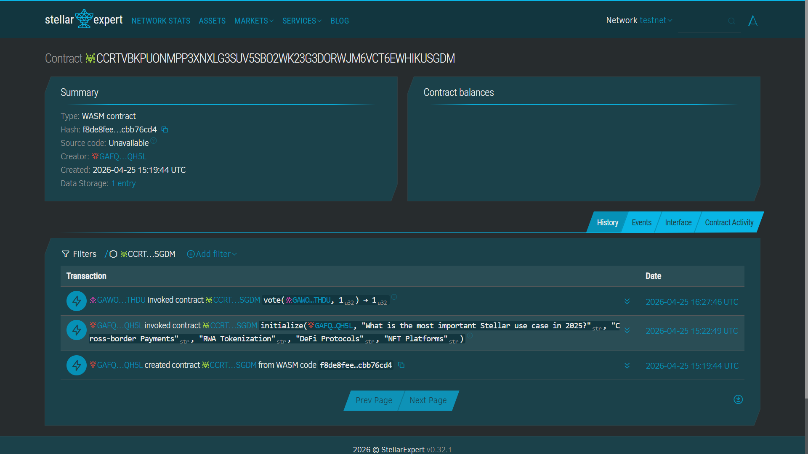

# ⭐ StellarPoll — Live On-Chain Voting dApp

**Stellar Frontend Challenge — Level 2: Yellow Belt**

A real-time on-chain poll dApp built on Stellar Testnet using Soroban smart contracts, StellarWalletsKit multi-wallet support, and live event streaming.

---

## ✨ Features

| Requirement | Implementation |
|---|---|
| **Multi-wallet** | StellarWalletsKit — Freighter, xBull, Albedo |
| **3 error types** | Wallet not found · User rejected · Insufficient balance |
| **Soroban contract** | `poll_contract` deployed on Testnet |
| **Contract called from frontend** | `vote()` invoked via TransactionBuilder |
| **Read + write contract data** | `get_results()` reads votes, `vote()` writes state |
| **Real-time events** | Contract emits `poll/vote` events, frontend streams live feed |
| **Transaction status** | Pending → Success (with hash) / Error (with type) |

---

## 🗂 Project Structure

```
stellar-live-poll/
├── contracts/
│   └── poll/
│       ├── src/lib.rs          # Soroban contract (Rust)
│       └── Cargo.toml
├── src/
│   ├── hooks/
│   │   ├── useWallet.js        # StellarWalletsKit integration
│   │   └── usePoll.js          # Contract calls + event listening
│   ├── components/
│   │   ├── WalletBar.jsx       # Multi-wallet connect UI
│   │   ├── PollCard.jsx        # Live voting with progress bars
│   │   ├── TxToast.jsx         # Transaction status display
│   │   └── ActivityFeed.jsx    # Real-time event stream
│   ├── App.jsx
│   └── main.jsx
├── deploy.sh                   # Contract deploy + init script
└── README.md
```

---

## 🚀 Setup Instructions

### 1. Prerequisites
- [Node.js](https://nodejs.org) v18+
- [Freighter Wallet](https://www.freighter.app/) (set to **Testnet**)
- Testnet XLM from [Friendbot](https://friendbot.stellar.org/)

### 2. Install & Run Frontend
```bash
git clone https://github.com/AditiM1729/stellar-live-poll
cd stellar-live-poll
npm install
cp .env.example .env
# Edit .env and set VITE_CONTRACT_ID=CCRTVBKPUONMPP3XNXLG3SUV5SBO2WK23G3DORWJM6VCT6EWHIKUSGDM
npm run dev
```
Open http://localhost:5173

### 3. Deploy the Soroban Contract

Install prerequisites:
```bash
# Install Rust
curl --proto '=https' --tlsv1.2 -sSf https://sh.rustup.rs | sh
rustup target add wasm32-unknown-unknown

# Install Stellar CLI
cargo install --locked stellar-cli

# Configure testnet
stellar network add testnet \
  --rpc-url https://soroban-testnet.stellar.org \
  --network-passphrase "Test SDF Network ; September 2015"
```

Generate and fund your key:
```bash
stellar keys generate --global my-key --network testnet
stellar keys fund my-key --network testnet
```

Deploy:
```bash
export SECRET_KEY=$(stellar keys show my-key --secret-key)
export PUBLIC_KEY=$(stellar keys address my-key)
chmod +x deploy.sh
./deploy.sh
```

Copy the printed contract ID into `.env`:
```
VITE_CONTRACT_ID=C...YOUR_CONTRACT_ID...
```

---

## 📸 Screenshots

### Wallet Options Available
 

### Live Poll with Votes


### Successful Transaction
 


---

## 📋 Submission Details

| Item | Value |
|---|---|
| **Deployed Contract ID** | `CCRTVBKPUONMPP3XNXLG3SUV5SBO2WK23G3DORWJM6VCT6EWHIKUSGDM` |
| **Transaction Hash** | `60ca23993a549128196e7c5d1db307f3b7b39fcbcd685d2806f03d7d4c5323de` |
| **Network** | Stellar Testnet |
| **Explorer** | [View Contract](https://stellar.expert/explorer/testnet/contract/CCRTVBKPUONMPP3XNXLG3SUV5SBO2WK23G3DORWJM6VCT6EWHIKUSGDM) |
| **Live Demo** | [Deployed on Vercel](https://YOUR_VERCEL_URL.vercel.app) |

---

## 🛠 Error Handling

Three error types are explicitly handled:

1. **Wallet Not Found** — Extension not installed → user shown install link
2. **User Rejected** — Wallet popup dismissed → clear message, no retry loop
3. **Insufficient Balance** → directs user to Friendbot for testnet XLM

---

## 🔗 Resources

- [Stellar Docs](https://developers.stellar.org)
- [Soroban Docs](https://soroban.stellar.org)
- [StellarWalletsKit](https://github.com/Creit-Tech/Stellar-Wallets-Kit)
- [Stellar Expert Testnet](https://stellar.expert/explorer/testnet)